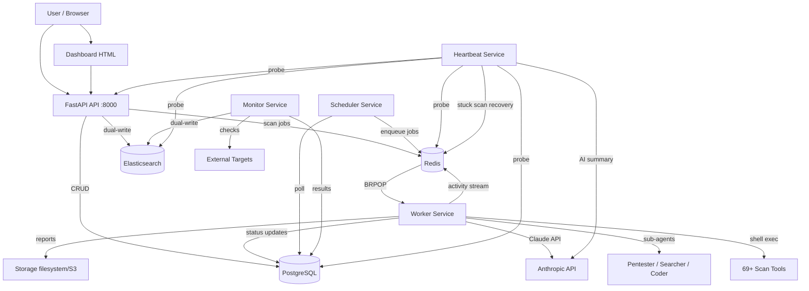

# Architecture

SSSAI is an AI-powered autonomous security scanning platform written in Python (backend) with a React frontend. Claude AI drives scan planning, tool execution, result interpretation, and report generation without manual configuration.

## Project Structure

```
security-scanner/
├── modules/                  # All backend Python source code
│   ├── agent/                # AI scan agent — Claude-driven autonomous scanning
│   │   ├── scan_agent.py     # Agent loop, sub-agents, summarization, checkpointing
│   │   ├── tools.py          # Tool definitions registered with the Anthropic SDK
│   │   ├── checkpoint.py     # Mid-scan checkpoint save/resume for crash recovery
│   │   └── prompts/          # System prompts per scan type + knowledge modules
│   ├── api/                  # FastAPI REST API
│   │   ├── main.py           # App bootstrap, routes, chat endpoints, dashboard
│   │   ├── auth.py           # JWT auth, bcrypt, rate limiting, 2FA (TOTP)
│   │   ├── database.py       # SQLAlchemy engine + session factory
│   │   ├── models.py         # ORM models (User, Scan, Monitor, Schedule, etc.)
│   │   ├── schemas.py        # Pydantic request/response models
│   │   ├── routes/           # Route modules: scans, auth, monitors, schedules, etc.
│   │   └── static/           # Server-rendered HTML dashboards
│   ├── worker/               # Queue consumer — picks scan jobs, runs agent
│   ├── scheduler/            # Cron-like service for recurring scans
│   ├── monitor/              # Uptime monitoring (HTTP, TCP, DNS, TLS checks)
│   ├── heartbeat/            # Platform health checks with AI-generated summaries
│   ├── infra/                # Infrastructure abstraction (local vs AWS)
│   │   ├── local_queue.py    # Redis-backed queue (BRPOP/LPUSH)
│   │   ├── aws_queue.py      # SQS queue implementation
│   │   ├── local_storage.py  # Filesystem storage (/output/)
│   │   ├── aws_storage.py    # S3 storage implementation
│   │   ├── elasticsearch.py  # Elasticsearch client, index setup, ILM
│   │   └── *_secrets.py      # Secrets from env vars or AWS Secrets Manager
│   ├── notifications/        # Multi-channel alert dispatcher (Slack, Discord, email, webhook)
│   ├── reports/              # HTML/PDF/JSON report generation (Jinja2 + WeasyPrint)
│   ├── tools/                # Tool registry — metadata for 80+ scanning tools
│   ├── sandbox/              # NemoClaw/OpenClaw/OpenShell sandboxed execution
│   └── config.py             # Central AI model selection and pricing
├── frontend/                 # React 19 + Vite SPA (in development)
├── docker/                   # Dockerfiles per service (api, worker, scheduler, monitor, heartbeat)
├── config/                   # NemoClaw/OpenClaw/OpenShell configuration YAML
├── scripts/                  # Utility scripts
├── templates/                # (reserved)
├── output/                   # Scan output files (mounted volume)
├── logs/                     # Application logs
├── reports/                  # Generated reports
└── docker-compose.yml        # Full stack orchestration (7 services + 3 data stores)
```

## Architectural Pattern

SSSAI follows a **service-oriented architecture with an AI agent core**. Five independent services communicate through Redis queues and a shared PostgreSQL database.

This pattern suits the project because:

- **Scan isolation**: The worker container runs 69+ security tools with `NET_RAW` capabilities, isolated from the API.
- **Independent scaling**: Workers, monitors, and the scheduler scale independently.
- **Fault tolerance**: Each service handles its own lifecycle (SIGTERM, graceful shutdown). The heartbeat service detects and auto-recovers stuck scans.
- **AI autonomy**: The agent loop needs long-running, stateful execution that would block a request-response API.

Key design principles:

- **Infrastructure abstraction**: Factory functions (`get_queue()`, `get_storage()`, `get_secrets()`) switch between local (Redis/filesystem) and AWS (SQS/S3) based on a single `RUNTIME` env var.
- **Fail-soft execution**: Non-critical failures (ES writes, notifications) are caught and logged without aborting the operation.
- **Agent self-correction**: Loop detection, execution monitoring, chain summarization, and the reflector pattern keep the AI agent on track across long scans.
- **Checkpoint recovery**: Scans save progress every 5 iterations; orphaned scans are auto-recovered on worker restart.

## Component Diagram



## Data Flow

### Scan Lifecycle

1. **Creation**: User submits target + scan type via Dashboard or API. API validates, creates a `Scan` record (status: `queued`), and pushes a job to the `scan-jobs` Redis queue.
2. **Pickup**: Worker `BRPOP`s the job. Updates status to `running`.
3. **Agent loop**: Claude receives a scan-type-specific system prompt. It plans 3–7 steps, then iterates: calling tools, interpreting results, delegating to sub-agents, adapting the plan based on discoveries.
4. **Safety rails**: Every 10 tool calls, an execution monitor LLM reviews progress. When conversation exceeds 80K chars, old messages are summarized. Loop detection flags repeated/oscillating tool calls. The reflector redirects text-only responses back to tool use.
5. **Checkpointing**: Every 5 iterations, scan state is saved. On worker crash, orphaned scans are re-queued with checkpoint context.
6. **Completion**: Agent calls the `report` tool with structured findings. Report is saved to storage. Scan status → `completed`. Notifications dispatched via configured channels.

### Chat Flow

- **Live scan chat**: Human messages pushed to `scan:chat:inbox:{scan_id}` in Redis. The running agent polls this inbox via the `ask_human` tool.
- **Post-scan chat**: Claude answers questions using the saved report as context, in a background thread.
- **Global chat**: A central AI brain with access to all user scans. Can trigger new scans and validate findings via action blocks in responses.

### Uptime Monitoring

The Monitor service polls active monitors at their configured intervals (default 300s). Check types: HTTP, TCP, DNS, TLS. State changes (`up` → `down`, `down` → `up`) trigger notifications. History stored in PostgreSQL + Elasticsearch.

## External Dependencies

| Dependency | Purpose | Abstraction |
|---|---|---|
| **Anthropic Claude API** | AI agent brain (scans, chat, heartbeat summaries) | Direct SDK (`anthropic` package) |
| **PostgreSQL 16** | Persistent data (users, scans, monitors, schedules, memory) | SQLAlchemy ORM via `modules/api/database.py` |
| **Redis 7** | Job queue, pub/sub, activity streaming, chat, caching | `modules/infra/local_queue.py` (RedisQueue) |
| **Elasticsearch 8.13** | Dual-write for logs, heartbeat, monitor checks, chat messages | `modules/infra/elasticsearch.py` |
| **DuckDuckGo** | Web search (HTML scraping, no API key) | `web_search` agent tool |
| **NVD + Exploit-DB** | CVE/exploit lookup (HTML scraping) | `exploit_search` agent tool |
| **SMTP** | Email notifications | `modules/notifications/dispatcher.py` |
| **Slack/Discord webhooks** | Alert notifications | `modules/notifications/dispatcher.py` |
| **OpenClaw/NemoClaw** | Optional sandboxed agent execution | `modules/sandbox/` |

## Infrastructure Abstraction

The `RUNTIME` env var (`local` or `aws`) switches all infrastructure via factory functions in `modules/infra/__init__.py`:

| Component | `RUNTIME=local` | `RUNTIME=aws` |
|---|---|---|
| Queue | Redis (BRPOP/LPUSH) | SQS |
| Storage | Filesystem (`/output/`) | S3 |
| Secrets | Environment variables | AWS Secrets Manager |
| Compute | Docker Compose | ECS Fargate |
| Database | Local PostgreSQL | RDS PostgreSQL |

## Autonomous Testing Primitives

The worker's AI agent is more than a shell dispatcher — it embeds eight
autonomous testing primitives (PRs #167-#174) that provide a tight
evaluation signal, parallelism, cross-scan memory, and adversarial
self-critique:

| Primitive                       | Module                                      | Purpose                                          |
|---------------------------------|---------------------------------------------|--------------------------------------------------|
| Budget-based stopping           | `modules/agent/budget.py`                   | Multi-axis token/cost/duration/iteration cap    |
| Model tiers + extended thinking | `modules/config.py`                         | Discovery/Reasoning/Critical/Light routing      |
| Auto-recall memory              | `modules/agent/memory.py`                   | Per-tenant cross-scan experience recall         |
| Exploitation gate               | `modules/agent/exploitation_gate.py`        | Prove-or-demote for high/critical findings      |
| Payload sweeper                 | `modules/agent/payload_sweeper.py`          | Curated read-only payload catalog (10 classes)  |
| Red-team critic                 | `modules/agent/critic_agent.py`             | Adversarial sub-agent challenges findings       |
| Parallel hypothesis executor    | `modules/agent/hypothesis_executor.py`      | Fan out N focused sub-agent investigations      |
| Autonomous agent flag           | `modules/agent/autonomous_agent.py`         | State-machine alternative (inactive, #173)      |

For the full deep-dive — scan lifecycle, tool registry, the 10
vulnerability classes tested, the non-destructive testing contract,
finding lifecycle, and operations — see
[**AUTONOMOUS_TESTING.md**](AUTONOMOUS_TESTING.md). For the (inactive)
state-machine alternative see
[AUTONOMOUS_AGENT_ARCHITECTURE.md](AUTONOMOUS_AGENT_ARCHITECTURE.md).

## Architecture Decision Records

### ADR-001: Claude as Autonomous Agent (Not Pipeline)

**Status**: Accepted

**Context**: Security scanning traditionally uses fixed pipelines (run tool A, then B, then C). This produces rigid, non-adaptive scans.

**Decision**: Use Claude as an autonomous agent that plans its own scan strategy, adapts to discoveries, and delegates to sub-agents.

**Rationale**: AI-driven scanning adapts to what it finds — discovering a WordPress site triggers CMS-specific tools. A chatbot endpoint triggers prompt injection testing. This produces more thorough, targeted results than fixed pipelines.

**Consequences**: Scans are non-deterministic. Cost scales with scan complexity. Requires safety rails (loop detection, execution monitoring, token limits).

### ADR-002: Redis as Message Bus (Not HTTP Callbacks)

**Status**: Accepted

**Context**: Services need to communicate scan jobs, activity streams, and chat messages.

**Decision**: Use Redis as the central message bus with BRPOP/LPUSH for job queues and lists for activity streaming.

**Rationale**: Redis provides both reliable queue semantics and low-latency pub/sub. The worker already needs Redis for activity streaming, so adding job queues avoids introducing another dependency.

**Consequences**: Single point of failure if Redis goes down. Mitigated by the heartbeat service detecting Redis health and the infrastructure abstraction allowing SQS swap.

### ADR-003: Dual-Write to Elasticsearch

**Status**: Accepted

**Context**: PostgreSQL handles transactional data well, but searching across logs, chat messages, and monitor checks needs full-text search and time-series capabilities.

**Decision**: Dual-write key events to Elasticsearch alongside PostgreSQL. ES writes are fire-and-forget — failures don't block operations.

**Rationale**: Keeps the primary data path reliable (PostgreSQL) while adding search/analytics capabilities. The fail-soft pattern means ES outages don't impact scanning.

**Consequences**: Data can drift between PostgreSQL and ES. Acceptable because ES is used for search/analytics, not as a source of truth.

### Template for Future ADRs

```markdown
### ADR-NNN: [Title]

**Status**: Proposed | Accepted | Deprecated | Superseded by ADR-XXX

**Context**: What is the issue that we're seeing that is motivating this decision?

**Decision**: What is the change that we're proposing and/or doing?

**Rationale**: Why is this the best choice given the constraints?

**Consequences**: What trade-offs does this decision introduce?
```
